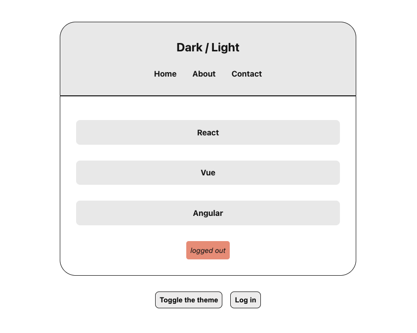
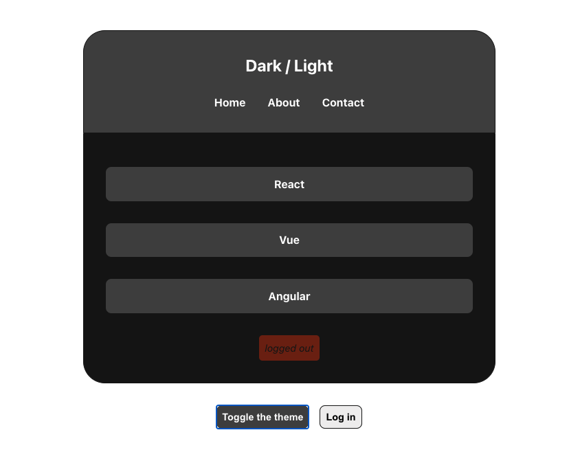
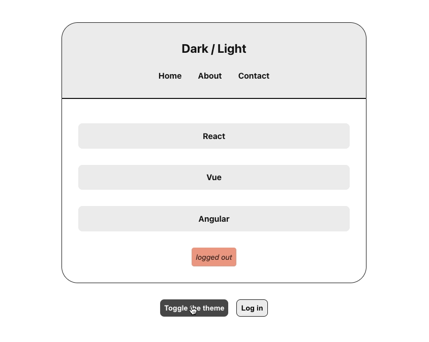

# 7. Dark and Light Mode - react.js
## Screenshots

## Features
- Use react context API and class components to build dark/light mode feature
- Click a button to toggle between dark and light mode (ThemeContext)
- Click a button to check logged in status (AuthContext)

## Skills
- HTML
- CSS
- JS
- React.js
- Context API (react.js)